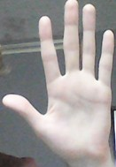
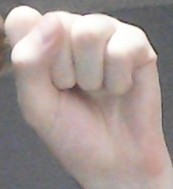
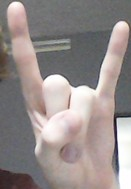

# Paint usando python y mediapipe
Este programa tiene como propósito recrear una aplicación estilo paint utilizando visión por computadora.

## Controles

El programa se controla con una mano, el cursor siendo su dedo índice y aplicando gestos, para comenzar ponga su mano en visión de la cámara. Cuando lo haga aparecerá los puntos claves dibujados sobre el lienzo blanco junto con las líneas que los conecta. Adicionalmente en el dedo índice verá alrededor un círculo sin fondo de contorno gris que tendrá el tamaño del grosor actual. Puedes salir del prograna en cualquier momento al presionar la tecla "esc".

## Selección de una acción

Para seleccionar una acción o acerque el cursor (dedo índice) al recuadro y cuando este sobre el extienda su pulgar y luego encójalo. El extender su pulgar cuenta como un click. Si la acción está activa verá un recuadro verde que encuadra la acción.

## Hold

Si la acción es pintar o borrar, cuando cierre el pulgar empezará a realizar la acción automáticamente, por lo que si no quiere hacerlo en ese mismo lugar en donde está el recuadro o simplemente quiere mover la mano sin dejar un rastro de pintura en el lienzo, puede abrir toda la mano, cuando ya esté en la posición deseada encoja cualquier dedo o todos exceptuando el índice y ya hará la acción.

## Deseleccionar una acción

De lo contrario si quiere deseleccionar alguna acción activa haga un puño.

## Selección de un color

Para seleccionar una acción o acerque el cursor (dedo índice) al recuadro y cuando este sobre el extienda su pulgar y luego encójalo.

## Acciones click e índice

#### Pintar

Deja un rastro del color seleccionado por donde pase el dedo índice, si no se está haciendo el gesto click o el hold.

#### Borrar

Borra el rastro dejando un espacio blanco en su lugar por donde pase el dedo índice, si no se está haciendo el gesto click o el hold.

#### Grosor+ y Grosor-

Agranda o disminuye el radio efectivo de pintar y borrar, se verá el tamaño actual afectado en el cursor.

#### Save 

Guarda el lienzo en el directorio donde esté el programa con el nombre y extensión Lienzo#.jpg, donde # es el número de lienzo exportado, este es por si hay uno ya con el mismo número en el directorio se pasa al siguiente

#### HideUI

Cuando se aprieta esconde los elementos del UI dejando ver solo el lienzo y la siguiente opción en su lugar.

#### Unhide

Regresa los elementos del UI.

#### Clear

Vuelve todo a como estaba cuando se inició el programa.

## Acciones click, índice y meñique

Hay acciones que requieren de confirmación extra o gestos que permiten saber cuando dejar de hacerlo o colocar objetos, por lo que se ideó levantar el meñique para ello.

#### Bucket

Una vez seleccionado la cubeta que lo que hace es llenar todo de un color, para poder aplicar la acción solo levante el dedo meñique cuando el cursor esté sobre la superficie que desee.

#### Línea, rectángulo/cuadrado, círculo

Las tres acciones constan de dos etapas, la colocación del primer parámetro y el segundo. Todas estas acciones se ven afectadas por el grosor que tenga el cursor, que vendrá siendo el grosor de la línea.

Para la línea una vez activa la acción levante el meñique y manténgalo así coloca el punto inicial, una vez hecho si mueva la mano por el lienzo verá como se forma una línea de recolocación para que observe donde quedaría la línea. Para confirmar el punto final solo encoja el dedo meñique.

Para el rectángulo es la misma secuencia solo que cuando levanta el meñique está colocando el punto donde irá una de las esquinas y cuando lo suelte está colocando la contra esquina.

El círculo es la misma secuencia, solo que cuando levanta el meñique está colocando el centro del círculo y cuando mueva la mano estará variando el radio hasta que encoja el meñique.

** AVISO ** Puedes usar este programa en lo que quieras, solo procura dar créditos al autor original y si gustas mandar o subir fotos de su aplicación para que pueda ponerlos en el refri como un padre orgulloso. :D

