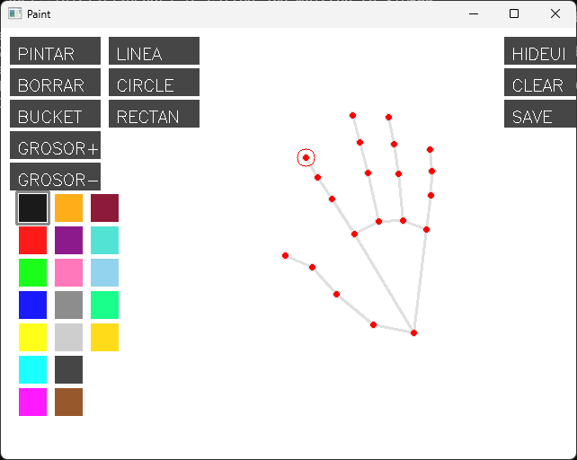
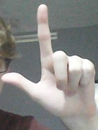
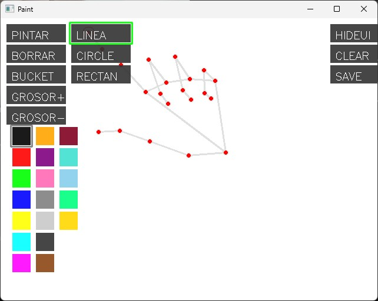

# Paint_w_Hands
Recreation of a basic paint like app with python and mediapipe to control with your hands.

## Controls
This program is controlled by exclusively one hand, the cursor being the index finger and by making gestures as complementary indications. When you initiate the program put your hand in range of the camera's vision. Ypu will see some key points painted over the white canvas with interconnected lines. Adiotionally you will see that the index finger has the outline of a circle which radius indicates the thickness of the cursor.
** You can exit the program by entering the "esc" key at any moment **

### Selecting an action
To select an action close in the cursor (index finger) to the action button of your desire and when is under it extend your thumb and close it. By extending your thumb while the cursor is under a button, the action it´s counted as a click. If the action is active you can see that the button has a green border around it. You can also do a hold action instead of closing your thumb, so it dosen´t apply the action to the canvas, until you only have the index finger extended.

  

### Selecting a color
You select a color the same way you select an action just make sure that your index finger is under the color box that you desire, extend your thumb and then close it. When a color is active you can see that there's a gray border around it's box. You can also do a hold action instead of closing your thumb, so it dosen´t apply the action to the canvas, until you only have the index finger extended.

### Hold
If the active action is painting or erasing, the action will be applied to the canvas once you only have the index finger extended, if you don´t want to inmediately apply it.

